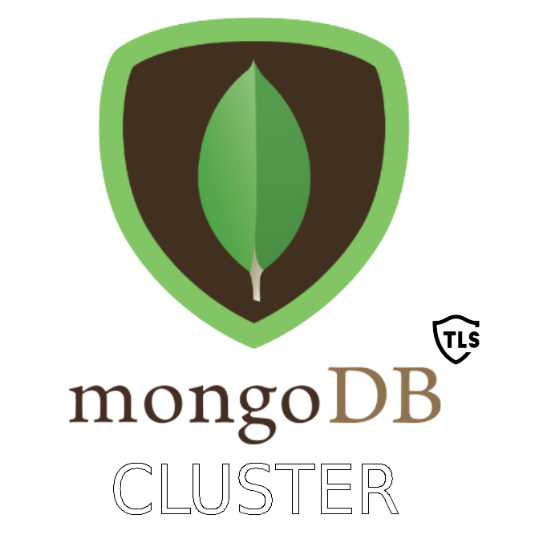
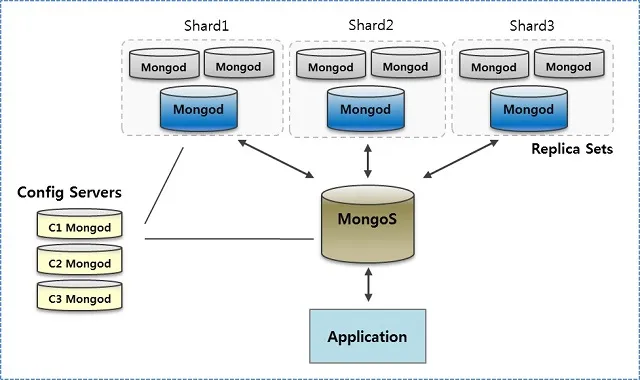

  

<h1 align="center">
  MongoDB-Cluster-TLS
</h1>

## MongoDB-Cluster-TLS &middot;       ##

This repository contains the configuration for deploying a `NoSQL` cluster of a `MongoDB` database with sharding and replication. Connections between all shards in a replica are authenticated using `x509` certificates and communicate with each other over a `TLS` connection. Communication between replicas occurs in a similar way. Communications with `Config Server` and `MongoS` are protected in a similar way. The client side connection to `MongoS` is protected in a similar way.

This project automatically deploys a `MongoDB` cluster in `Docker` containers, creates its own certificate authority, generates and distributes authentication keys and keys for a `TLS` connection for each element of the `MongoDB` cluster, as well as for a client that will connect to `MongoS`. The cluster consists of a `MongoS` router, three `Config Server`, three replicas, each with 3 shards.

The general scheme of the `MongoDB` cluster is shown in the image:  

## :computer: Getting Started  ##

**Step 1**

1. Go to home directory and clone repository from github: `cd ~ && git clone https://SergeyIvanovDevelop@github.com/SergeyIvanovDevelop/MongoDB-Cluster-TLS`

**Step 2** 

2. Go to the directory of the downloaded repository: `cd ~/MongoDB-Cluster-TLS`

**Step 3** 

3. You must have installed [openssl](https://www.openssl.org/), [docker](https://www.docker.com/), [docker-compose](https://docs.docker.com/compose/install/) and [MongoDB](https://www.mongodb.com/). 

**Step 4** 

4. You need to build `Docker` images/containers and generate keys: `./run_all.sh build`

**Step 5** 

5. You need to recreate/run `Docker` containers: `./run_all.sh run`

**Step 6** 

6. Check the connection from the client with `MongoS`: `./connect_tls_to_mongos.sh`

If you manage to enter the `MongoDB` command line, then everything is done correctly and the cluster is functioning correctly.

_`Mongodb` logs from `Docker` containers can be viewed in the shared folder [SHARE_WITH_ALL_DOCKER_CONTAINERS](./SHARE_WITH_ALL_DOCKER_CONTAINERS)_.

### :bookmark_tabs: Licence ###
MongoDB-Cluster-TLS is [CC BY-NC-SA 3.0 licensed](./LICENSE).
